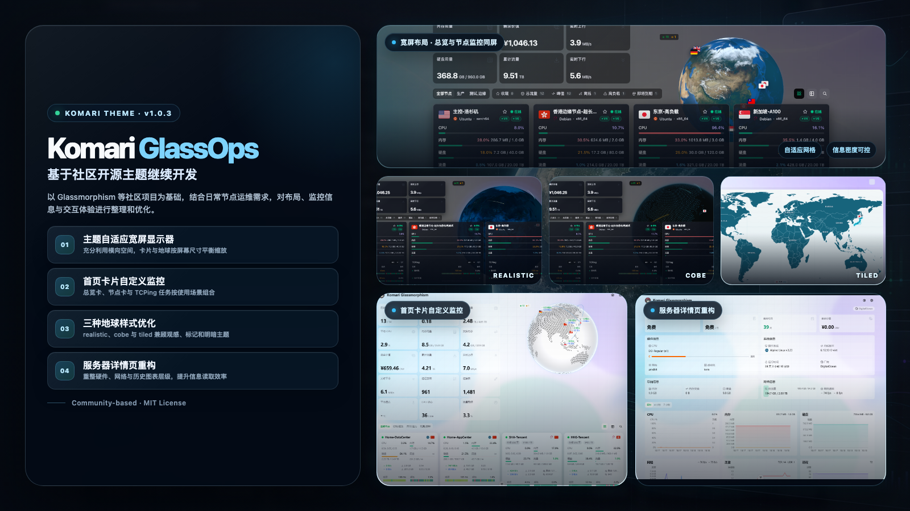

# Komari GlassOps

Komari GlassOps 不是从零开始的全新主题，也不是 Komari 官方主题。它以 [Komari Glassmorphism](https://github.com/sanrokamlan-prog/komari-theme-Glassmorphism) 等社区开源项目为基础，结合自己的日常节点运维需求继续整理和优化。

当前版本主要调整了首页信息层级、节点收藏与检索、多任务 Ping 可视化、三种地球视图、详情页操作和移动端布局。默认保留暗色毛玻璃外观，但优先保证数据能看清、控件能使用、不同宽度下不挤压错位。



## 当前版本

- 版本：`1.0.8`
- 状态：稳定维护版，已适配 Komari 1.4.3
- 默认主题：暗色
- 包格式：Komari 可直接导入的主题 ZIP

本阶段已完成本地构建、自动化交互、常用配置组合和视觉回归。真实 Komari 环境的上传、启用与长期运行仍应在发布前单独验证。

## 版本演进

GlassOps 在首次公开发布前经历了三个清晰的迭代阶段：

| 版本     | 定位           | 主要内容                                                                                                           |
| -------- | -------------- | ------------------------------------------------------------------------------------------------------------------ |
| `v1.0.1` | 基础成型       | 完成独立名称、清单、来源与许可说明；整理深浅色玻璃层级、四种节点卡片密度和主题设置基础结构。                       |
| `v1.0.2` | 监控扩展       | 加入每台节点独立 TCPing 任务、收藏与增强检索、快捷筛选、节点对比，以及详情页和图表交互重构。                       |
| `v1.0.3` | 首次公开发布   | 收口宽屏自适应、三种地球视图、统一流星动效、节点标签、悬浮性能和 Komari 1.3.2 兼容性，并补齐自动构建与浏览器回归。 |
| `v1.0.5` | 视觉维护更新   | 优化节点标签弹窗、累计流量与续费信息的状态提醒，并提升深浅色及 mini 卡片的文字可读性。                             |
| `v1.0.6` | 显示细节维护   | 统一 compact/mini 摘要状态层级，修正无限流量的中性显示，完善标签弹窗宽度，并增强 tiled 浅色海洋纹理。              |
| `v1.0.7` | 地球视觉升级   | realistic 加入实时昼夜、分层城市夜光、宽幅透明大气层与无遮挡拖动，并重新平衡浅色地貌曝光。                         |
| `v1.0.8` | 兼容与性能维护 | 适配 Komari 1.4.3 管理后台，补齐 CPU 历史回退，统一 Ping 任务顺序，并合并首页 Ping 历史请求。                      |

`v1.0.1`、`v1.0.2` 是开发过程中的里程碑，GitHub 正式发布从 `v1.0.3` 开始。`v1.0.4` 未单独发布，`v1.0.5`–`v1.0.8` 为公开维护版本。后续版本继续使用语义化版本号：修复问题递增补丁版本，兼容新增功能递增次版本，存在不兼容变化时才递增主版本。完整记录见 [CHANGELOG.md](CHANGELOG.md)。

## 三种地球与地图

- `realistic`：使用实时太阳位置区分昼夜半球，夜面按 Black Marble 灯光信号呈现分层聚居光点，深色模式带透明蓝色大气层；节点国旗不附加白色底壳，启用动画时会以较舒缓的间隔生成一组三条长光轨汇入节点位置
- `cobe`：点阵球体采用低亮度深蓝底，仅让节点、少量连线和轨道保留克制的局部光点
- `tiled`：使用随主题打包的本地国家边界数据绘制单色简约分区图，提供主要国家/版块标注、深浅主题适配与多节点收缩/汇总，不依赖在线地图瓦片

光轨会尊重“减弱过渡动画”和操作系统的减少动态效果设置。

## 节点操作与检索

- 卡片、列表和详情页均可收藏节点，收藏状态保存在当前浏览器
- 首页可一键筛选收藏节点
- 搜索覆盖名称、地区、IPv4/IPv6、CPU/GPU、UUID、系统、架构、标签和分组
- IPv4 支持 `192.168.x.x`、`192.168.*.*` 形式的通配搜索
- 节点详情支持上一台、下一台和下拉快速切换
- 首页工具可对最多 4 台节点做实时横向比较
- 节点超过 30 台时，卡片按视口优先延迟渲染，降低首屏压力

## 首页节点卡

每张卡片按运维查看顺序显示：

- 地区、节点名、在线状态、系统和架构
- CPU、内存、硬盘占用
- TCP / UDP 连接数
- 0–3 个独立 TCPing 任务的最新延迟、四小时走势和丢包
- 实时上行、实时下行和运行时间

延迟任务按任务分别展示，不做跨城市或跨任务平均。未配置节点默认读取该节点前三个适用任务；明确清空后，该节点首页不显示 TCPing 区域。

## 首页延迟监控配置

管理员登录后，首页右上角会出现“首页延迟监控”入口：

- 仅列出公开服务器
- 支持按服务器名称、地区或系统搜索
- 每台服务器可选择 0–3 个已存在且适用于该节点的 Ping 任务
- 支持任务搜索、排序、移除、清空和恢复主题默认
- 保存后写入 Komari 当前主题设置，并对全站访客生效

访客看不到配置入口，也不能保存配置。打开弹窗和点击保存时都会重新验证登录状态；会话过期时拒绝写入。保存前会重新读取并合并最新完整主题设置，避免覆盖其他配置项。

## 安装

1. 从 Releases 下载最新的 `komari-glassops-v*-build-*.zip`。
2. 在 Komari 管理后台打开主题管理。
3. 上传 ZIP，启用 `Komari GlassOps`。
4. 首次测试建议保持默认配置和暗色模式。

当前本地构建包也遵守相同结构：

```text
komari-theme.json
preview.png
preview-v<version>.png
dist/
```

## 当前验收范围

当前 `v1.0.8` 本地回归已覆盖：

- 暗色默认模式与首次加载背景
- 桌面卡片布局和独立 Ping 任务数据
- 管理员入口、访客隐藏、公开节点过滤
- 0、1–3 项任务配置、排序、清空与恢复默认
- 完整主题设置合并保存
- 保存前会话过期处理
- 320、360、390、430px 手机宽度
- 离线节点、缺少数据和不同资源占用状态
- 类型检查、代码规范、生产构建和 ZIP 结构
- 桌面/手机、明暗色、四种卡片密度、卡片/列表、三种地球视图和隐藏头部组合
- 收藏、增强搜索、详情切换和图表固定提示外部解除交互
- Ping 提示框快速滑动、玻璃文字对比度和横向溢出检查
- realistic 实时昼夜、分层城市夜光、深色透明大气层、浅色地貌曝光、无遮挡拖动与三条长光轨节奏
- Cobe 低亮光点和 Tiled 无黑边单色地图
- Komari 1.4.3 内嵌后台版本门控、CPU 历史兼容回退、Ping 任务顺序与首页批量读取

这些结果只代表固定虚构数据下的本地浏览器与构建验证，不等同于所有 Komari 版本、反向代理和真实节点规模都已验证。

## 开发

环境要求：

- Bun `>= 1.2`
- Node.js `>= 22`

```bash
bun install --frozen-lockfile
bun run dev
bun run lint
bun run build
bun run test:visual
```

`bun run build` 会生成 `dist/` 和 `komari-glassops-v<version>-build-<short-sha>.zip`。工作区有未提交修改时，构建标识会追加 `-dirty`，避免把测试包误认为可复现提交。版本号只维护在 `komari-theme.json`。

视觉回归使用完全虚构的固定节点数据，不连接真实 Komari、账号或服务器；更新界面基准时运行 `bun run test:visual:update`，确认截图后再提交。

新增代码遵循：

```text
Component -> Composable -> Service -> RequestManager / CacheService -> API / RPC
```

详细开发约束见 [AIAGENTREADME.md](AIAGENTREADME.md)，上游与设计参考说明见 [NOTICE.md](NOTICE.md)。

## 上游策略

GlassOps 作为独立仓库自行维护，不要求每次功能更新都依赖上游发布。上游 Glassmorphism 只作为可选择同步的视觉和技术来源：

1. 定期查看上游提交。
2. 只挑选明确有价值的修复或兼容改进。
3. 在独立分支完成差异审查、构建和浏览器验证。
4. 不直接把上游主分支无审查合并到发布分支。

Komari 核心接口变化需要单独跟踪；主题对后端行为的假设应以实际接口和安装验证为准。

## 来源与许可

本项目基于 Glassmorphism 主题的 MIT 代码基础继续开发，并参考其他社区主题的信息组织方式；它不试图掩盖上游来源，也不把社区已有成果描述成完全原创。具体来源、基线提交和未复制源码的说明见 [NOTICE.md](NOTICE.md)。

本项目沿用 [MIT License](LICENSE)。
